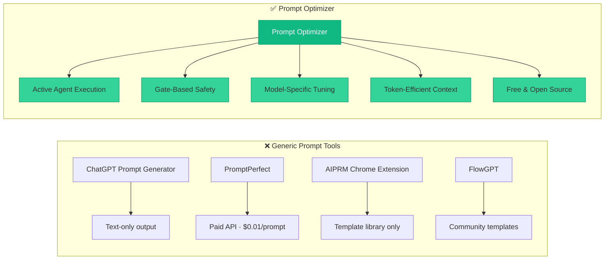
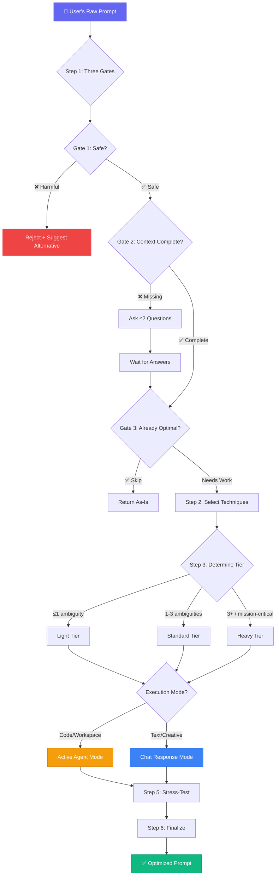
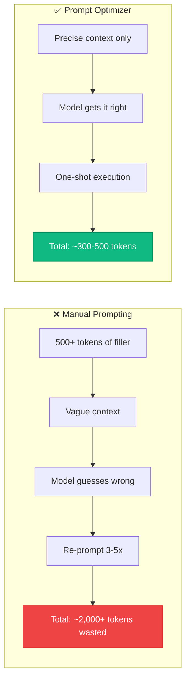

# 🧠 Prompt Optimizer

> **One skill to turn any raw idea into a production-grade AI instruction — tuned for Gemini, Claude, GPT, open-source models, and AI Coding Agents.**

Rewrites raw prompts into professional, structured, model-tuned instruction sets — applying persona framing, active agent execution framing, structured reasoning, constraint layering, and output-schema specification.

Built for **AI Coding Agents** (Antigravity, Cursor, Claude Code, Copilot Workspace), **Gemini**, **Claude**, **GPT**, and **open-source models** (Llama, Mistral, DeepSeek, Qwen).

---

## ⚡ Quick Installation

Copy and paste **one prompt** to your AI assistant and it will automatically install the skill:

```text
Create a new skill called "Prompt Optimizer" by performing the following steps:

1. Create the directory: ~/.gemini/config/skills/prompt_optimizer/
2. Create the directory: ~/.gemini/config/skills/prompt_optimizer/references/
3. Download and save the SKILL.md file from:
   https://raw.githubusercontent.com/mhammed2008/prompt-optimizer/main/SKILL.md
   → Save to: ~/.gemini/config/skills/prompt_optimizer/SKILL.md
4. Download and save the guide.md file from:
   https://raw.githubusercontent.com/mhammed2008/prompt-optimizer/main/references/guide.md
   → Save to: ~/.gemini/config/skills/prompt_optimizer/references/guide.md

After creating the files, confirm the installation by listing the contents of ~/.gemini/config/skills/prompt_optimizer/
```

> **That's it.** Your AI assistant will create the directories, download the files, and install the skill automatically. No manual setup required.

### Manual Installation

```bash
# Clone the repository
git clone https://github.com/mhammed2008/prompt-optimizer.git

# Copy to your skills directory
cp -r prompt-optimizer ~/.gemini/config/skills/prompt_optimizer
```

### Invocation

Once installed, trigger the skill with any of these:

| Command | Example |
|---|---|
| **Direct invoke** | `/Prompt Optimizer` |
| **Natural language** | `"Optimize this prompt for Claude: ..."` |
| **Refine request** | `"Improve my prompt to build a full-stack app"` |
| **Polish for agent** | `"Make this prompt work with Cursor/Antigravity"` |

---

## 🔥 Why Prompt Optimizer?

### The Problem

You write a prompt like:

> *"fix the login page and add dark mode"*

And the AI gives you... **a wall of code blocks in chat.** You copy, paste, debug, re-paste, fix imports, re-run. Repeat 10 times.

### The Solution

Prompt Optimizer rewrites that into a **structured, agentic instruction** that commands the AI to:

1. **Inspect your actual project files**
2. **Edit code directly in your workspace**
3. **Create an implementation plan**
4. **Run verification commands**

No copy-pasting. No manual debugging. One prompt → full execution.

---

## 📊 Prompt Optimizer vs. Other Tools

### Feature Comparison



### Detailed Comparison Table

| Feature | Prompt Optimizer | ChatGPT Prompt Gen | PromptPerfect | AIPRM | FlowGPT |
|---|:---:|:---:|:---:|:---:|:---:|
| **Dynamic Skill Routing (Anti-Skill Hell)** | ✅ Local + Web/Internet search | ❌ | ❌ | ❌ | ❌ |
| **Meta-Skill Orchestration** | ✅ Routes to specialized skills | ❌ | ❌ | ❌ | ❌ |
| **Active File Editing** | ✅ | ❌ | ❌ | ❌ | ❌ |
| **Implementation Plans** | ✅ | ❌ | ❌ | ❌ | ❌ |
| **Safety Gates (Reject/Clarify/Skip)** | ✅ | ❌ | ❌ | ❌ | ❌ |
| **Model-Specific Tuning** | ✅ Gemini/Claude/GPT/OSS/Agents | ❌ GPT only | ⚠️ Limited | ❌ GPT only | ❌ |
| **Open-Source Model Support** | ✅ Llama/Mistral/DeepSeek/Qwen | ❌ | ❌ | ❌ | ❌ |
| **Token-Efficient Context Injection** | ✅ | ❌ | ❌ | ❌ | ❌ |
| **Workspace-Aware** | ✅ Reads your project | ❌ | ❌ | ❌ | ❌ |
| **Proportional Tiering** | ✅ Light/Standard/Heavy | ❌ One-size-fits-all | ❌ | ⚠️ Categories | ❌ |
| **Reasoning Model Support** | ✅ o1/o3/Thinking | ❌ | ❌ | ❌ | ❌ |
| **Interactive Clarification** | ✅ ask_question tool | ❌ | ❌ | ❌ | ❌ |
| **Prompt Security** | ✅ Anti-injection + PII handling | ❌ | ❌ | ❌ | ❌ |
| **Free & Open Source** | ✅ MIT License | ✅ Free | ❌ Paid | ⚠️ Freemium | ✅ Free |
| **IDE Integration** | ✅ Native skill | ❌ Web only | ❌ API | ⚠️ Extension | ❌ Web only |

---

## 🧩 Architecture — How It Works



---

## 🌟 Full Feature List

### 🎯 Active Agent Execution Framing
The **#1 differentiator**. Other tools generate text you copy-paste. Prompt Optimizer generates instructions that command AI agents to:
- **Inspect workspace files** before making changes
- **Edit code directly** in your project — no copy-pasting
- **Create implementation plans** for complex tasks
- **Run verification commands** (`npm test`, `php artisan test`, `flutter analyze`)

### 🧭 Anti-Skill Hell & Meta-Skill Routing
Saves users from managing dozens of installed skills manually. Prompt Optimizer acts as a **Meta-Skill & Skill Router**:
- **Local Skill Discovery**: Automatically instructs target agents to scan locally installed skills (`~/.gemini/config/skills/`, `.agents/skills/`, installed plugins/MCP) and inspect matching `SKILL.md` files before writing code.
- **Web/Internet Skill Search Fallback**: If no local skill matches, it commands the agent to search the web/internet for standard community skills, official CLI specifications, or domain best practices.
- **Zero Hardcoded Names**: Matching happens dynamically on domain keywords—no rigid hardcoding.

```
❌ Without Meta-Skill: Agent writes naive custom code from scratch, ignoring existing skills.
✅ With Prompt Optimizer: Agent scans local/web skills, reads SKILL.md, and applies domain best practices.
```

### 💰 Token-Efficient Context Injection
Prompt Optimizer **injects only the critical context needed** — no bloat, no filler.



| Scenario | Manual Prompting | With Prompt Optimizer | Savings |
|---|---|---|---|
| Simple fix | ~200 tokens × 3 retries | ~150 tokens × 1 shot | **75% fewer tokens** |
| Feature addition | ~500 tokens × 4 retries | ~400 tokens × 1 shot | **80% fewer tokens** |
| Full project scaffold | ~1000 tokens × 5 retries | ~600 tokens × 1 shot | **88% fewer tokens** |

### 🛡️ Three-Gate Safety System
Every prompt passes through **3 sequential gates** before optimization:

| Gate | Purpose | Example |
|---|---|---|
| **Gate 1: Reject** | Blocks harmful or impossible requests | Polishing a phishing email → Rejected |
| **Gate 2: Clarify** | Asks ≤2 targeted questions for missing critical context | "Fix my API" → "Which framework? Which endpoint?" |
| **Gate 3: Skip** | Avoids bloating already-good prompts | "Format this JSON" → Returned as-is |

### 🛠️ Model Syntax Adapters & System Prompt Intelligence
Built from deep analysis of official production system prompts from Anthropic, Google, Cursor, and OpenAI:
- **Claude (Anthropic)**: Formats section boundaries with XML tags (`<role>`, `<task>`, `<constraints>`, `<agent_lifecycle>`).
- **Gemini (Google)**: Uses flat Markdown headers (`## Role`, `## Context`, `## Execution Steps`) and single-sentence silent thought step framing.
- **GPT & OpenAI Codex**: System/user message boundaries, `# Assistant Response Preferences` memory tracking (`Confidence=high`), and explicit `[ROLE] → [CONTEXT] → [TASK]` delimiters.
- **Cursor / Antigravity Agents**: Enforces strict `<making_code_changes>` rules (**MUST Read before Edit**, no comment thinking scratchpad, line citations).
- **Agent Lifecycle Signals**: Injects status tokens (`result: <summary>`, `needs input: <reason>`, `failed: <reason>`) for background and automated execution runs.


### 📐 Proportional Three-Tier Architecture
Matches prompt complexity to task complexity — never over-engineers or under-specifies:

| Tier | When | What You Get |
|---|---|---|
| **Light** | Single action, no ambiguity | Task + Constraints (2-3 lines) |
| **Standard** | 1-3 unknowns, single domain | Role + Context + Task + Actions + Constraints |
| **Heavy** | Cross-domain, production, mission-critical | Full structure + reasoning + anti-instructions + verification |

### 🎯 Model & Agent-Specific Tuning
One prompt doesn't fit all models. Prompt Optimizer tunes output for each target:

| Target | Optimization Strategy |
|---|---|
| **AI Coding Agents** | `## Direct Workspace Actions` section, file paths, verification commands |
| **Gemini** | Markdown headers, flat numbered lists, system-level role framing |
| **Claude** | XML tags (`<context>`, `<task>`), detailed anti-instructions |
| **GPT** | System/user separation, 2-3 few-shot examples, JSON schema |
| **Open-Source** (Llama, Mistral, DeepSeek, Qwen) | Markdown headers, <2000 tokens, explicit output format, Light/Standard only |
| **Reasoning Models** | Unconstrained internal reasoning, rigid output constraints |

### 🔒 Prompt Security & PII Handling
Built-in guardrails for production prompts handling user input:
- Delimiter isolation (`<user_input>...</user_input>`)
- Anti-injection constraints
- Instruction ordering enforcement
- System prompt protection
- **PII/credential stripping** — automatically generalizes sensitive data (API keys, passwords, internal URLs) before including in optimized prompts

### 🔄 Less Work, Full Projects from a Single Prompt
Traditional workflow vs. Prompt Optimizer workflow:

```mermaid
graph TD
    subgraph "❌ Traditional: 8 Steps"
        T1["1. Write vague prompt"] --> T2["2. Get code blocks"]
        T2 --> T3["3. Copy to files manually"]
        T3 --> T4["4. Fix missing imports"]
        T4 --> T5["5. Debug errors"]
        T5 --> T6["6. Re-prompt for fixes"]
        T6 --> T7["7. Copy-paste again"]
        T7 --> T8["8. Maybe it works"]
    end

    subgraph "✅ Prompt Optimizer: 2 Steps"
        P1["1. /Prompt Optimizer + your idea"] --> P2["2. AI executes everything"]
    end

    style T8 fill:#ef4444,stroke:#dc2626,color:#fff
    style P2 fill:#10b981,stroke:#059669,color:#fff
```



---

## 📁 Repository Structure

```
.
├── SKILL.md             # Core runtime skill (~280 lines) — loaded by AI agents
├── references/
│   └── guide.md         # Extended rationale, examples & version history (~570 lines)
├── benchmarks/
│   └── test_prompts.md  # 10-test benchmark suite for validation
└── README.md            # This file
```

---

## 🚀 Usage Examples

### From Idea → Full Project (Single Prompt)

**You say:**
> "build me a task management app with React and Node.js"

**Prompt Optimizer generates:**
```text
## Role
Act as a senior full-stack engineer specializing in React and Node.js.

## Context
Empty workspace. User wants a complete task management application.

## Task
Build a full-stack task management app with React frontend and Node.js/Express backend.

## Direct Workspace Actions
1. Initialize project structure (client/ and server/ directories).
2. Set up Express.js backend with REST API endpoints for CRUD operations on tasks.
3. Set up React frontend with components for task list, task creation, and task editing.
4. Connect frontend to backend via fetch/axios.
5. Apply all code directly to workspace files.

## Constraints
- Do NOT output code blocks in chat — create all files directly.
- Use functional React components with hooks.
- Include proper error handling on both client and server.
- Add inline comments explaining architectural decisions.

## Verification
1. Verify all files are syntactically correct.
2. Confirm API endpoints respond correctly.
3. Ensure frontend components render without errors.
```

---

## 📄 License

MIT License. Free to use, modify, and distribute.

---

<p align="center">
  <b>Stop copy-pasting code blocks. Start commanding AI agents.</b><br>
  <code>/Prompt Optimizer</code> — one skill to rule them all.
</p>
