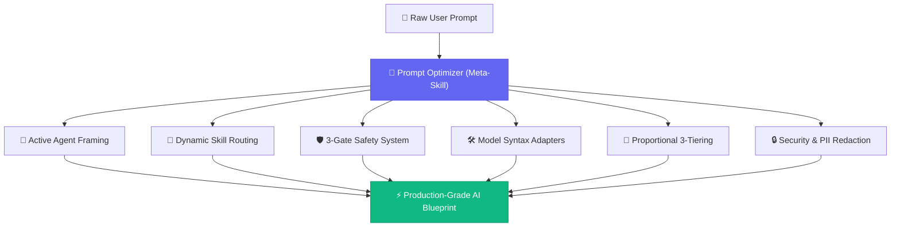
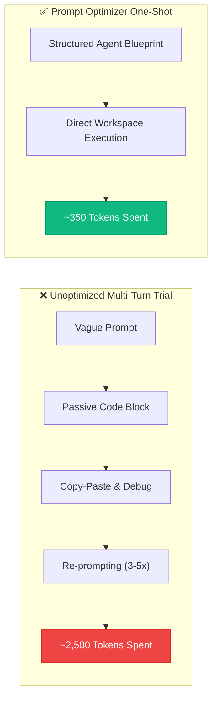
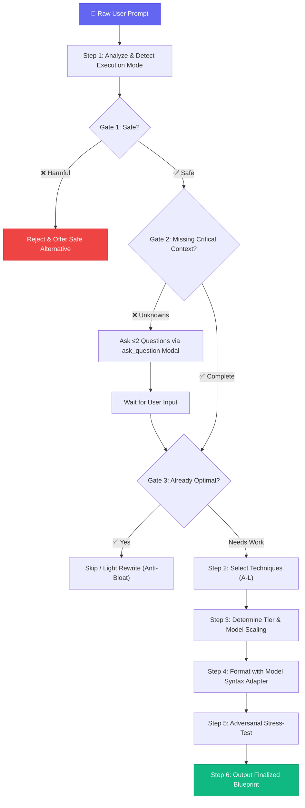

# 🧠 Prompt Optimizer

<p align="center">
  
  
  
  
</p>

<p align="center">
  <b>The Enterprise-Grade Meta-Skill, Context Engine & Skill Router for AI Coding Agents and Large Language Models.</b><br>
  Transform raw, underspecified prompts into KV-cache-optimized, model-tuned, autonomous execution blueprints.
</p>

---

## 🚀 Executive Summary

**Prompt Optimizer** is an autonomous **Meta-Skill and Skill Router** designed for modern AI development environments (**Antigravity, Cursor, Claude Code, GitHub Copilot Workspace**) and frontier LLMs (**Gemini, Claude, GPT, Llama, DeepSeek, Qwen**).

Unlike legacy prompt generators that produce passive text snippets for copy-pasting, Prompt Optimizer produces **Active Agent Execution Instructions**. It commands AI agents to inspect project workspaces, edit codebase files directly, construct implementation plans, search local/web skill registries, and execute empirical build/test verification commands.

---

## 🔥 Key Pillars & Capabilities



### 1. 🎯 Active Agent Execution Framing

- **Problem**: Standard prompts trigger AI agents to output walls of markdown code blocks in chat. Developers waste time copy-pasting, fixing imports, and manually debugging.
- **Solution**: Injects `Direct Workspace Actions` and `<making_code_changes>` directives that command agents to:
  - Open and inspect target files before writing edits.
  - Apply code modifications directly to workspace files.
  - Run empirical test suites (`npm test`, `php artisan test`, `pytest`, `flutter analyze`).

### 2. 🧭 Dynamic Skill Routing (Anti-Skill Hell Protocol)

- **Problem**: As developers install dozens of AI skills, they encounter **"Skill Hell"**—forgetting which skills exist, or having agents write naive custom code from scratch when a dedicated skill is available.
- **Solution**: Functions as a **Meta-Skill & Skill Router**:
  - **Local Skill Discovery**: Automatically instructs target agents to scan local skill roots (`~/.gemini/config/skills/`, `.agents/skills/`, plugin MCPs) and inspect `SKILL.md` before coding.
  - **Web & Internet Skill Search Fallback**: If no local skill matches, commands the agent to run a targeted web search (`search_web`, Google, GitHub) for specialized community skills, CLI specifications, or standard agent instruction sets.
  - **Zero Hardcoding**: Skill routing matches dynamically on task domain keywords (`<task_domain>`).

### 3. 🛡️ Three-Gate Safety & Quality System

Every prompt passes through **3 sequential gates** before optimization:

- **Gate 1 (Reject)**: Instantly blocks harmful, unsafe, or impossible requests.
- **Gate 2 (Clarify)**: Identifies missing _critical context_ and asks **at most 2 targeted questions** using native IDE modals (`ask_question`). Auto-defaults remaining parameters to prevent user interrogation fatigue.
- **Gate 3 (Skip / Anti-Bloat)**: Protects simple prompts (`"format this json"`) from being bloated into 30-line structural prompts.

### 4. 🛠️ Model Syntax Adapters & Reasoning Intelligence

Tailors prompt geometry to the exact target LLM architecture:

- **Claude (Anthropic)**: XML tag section boundaries (`<role>`, `<task>`, `<constraints>`, `<agent_lifecycle>`) with completion tokens (`result: <summary>`).
- **Gemini (Google)**: Flat Markdown headers (`## Execution Steps`), procedural lists, and single-sentence silent thought step framing.
- **GPT & OpenAI Codex**: System/user message boundaries, `# Assistant Response Preferences` memory tracking, and explicit `[ROLE] → [CONTEXT] → [TASK]` delimiters.
- **Open-Source Models (Llama 3, Mistral, DeepSeek, Qwen)**: Compact Markdown (<2000 tokens), zero XML tags, strict schema limits, and format hallucination prevention.
- **Reasoning Models (o1/o3, Gemini Thinking, Extended Thinking)**: Constrains output format and workspace actions while leaving internal chain-of-thought unconstrained.

### 5. 🔒 Production Security & PII Redaction

- **Anti-Injection Isolation**: Encapsulates untrusted inputs in `<user_input>` delimiters with explicit override protection rules.
- **Credential & Secret Stripping**: Automatically redacts API keys (`sk-...`), passwords, database connection strings, and sensitive PII into safe generalized placeholders (`YOUR_API_KEY`, `[database-host]`).

### 6. 🔗 Multi-Prompt Sequential Chaining

- Decomposes monolithic architectural requests ("build a full-stack e-commerce app") into an ordered sequence of 2-4 dependent sub-prompts (Backend → Frontend → Integration) with explicit handoff points.

---

## 📊 Comprehensive Tool Comparison

| Capability / Feature                        |        Prompt Optimizer (v11)        | ChatGPT Prompt Gen | PromptPerfect |     AIPRM     |   FlowGPT    |
| ------------------------------------------- | :----------------------------------: | :----------------: | :-----------: | :-----------: | :----------: |
| **Active File Editing Directive**           |    ✅ **Direct Workspace Edits**     |    ❌ Text Only    | ❌ Text Only  | ❌ Text Only  | ❌ Text Only |
| **Dynamic Skill Routing (Anti-Skill Hell)** |      ✅ **Local + Web Search**       |         ❌         |      ❌       |      ❌       |      ❌      |
| **Meta-Skill Orchestration**                |  ✅ **Discovers & Invokes Skills**   |         ❌         |      ❌       |      ❌       |      ❌      |
| **Safety Gates (Reject / Clarify / Skip)**  |        ✅ **3-Gate Pipeline**        |         ❌         |      ❌       |      ❌       |      ❌      |
| **Model-Specific Syntax Adapters**          |  ✅ **Claude / Gemini / GPT / OSS**  |    ❌ GPT Only     |  ⚠️ Limited   |  ❌ GPT Only  |      ❌      |
| **Open-Source Model Scaling**               |    ✅ **Llama / DeepSeek / Qwen**    |         ❌         |      ❌       |      ❌       |      ❌      |
| **Token-Efficient Proportionality**         |   ✅ **Light / Standard / Heavy**    | ❌ Fixed Template  |      ❌       | ⚠️ Categories |      ❌      |
| **Interactive IDE Clarification**           |      ✅ **ask_question Modals**      |         ❌         |      ❌       |      ❌       |      ❌      |
| **Security & PII Sanitization**             |  ✅ **Anti-Injection + Redaction**   |         ❌         |      ❌       |      ❌       |      ❌      |
| **Empirical Verification Step**             | ✅ **Automated Build/Test Commands** |         ❌         |      ❌       |      ❌       |      ❌      |
| **Open Source & Free**                      |          ✅ **MIT License**          |      ✅ Free       |  ❌ Paid API  |  ⚠️ Freemium  |   ✅ Free    |

> **Note**: This comparison reflects feature presence specifically in the **prompt optimization and agentic coding** context. Other tools may excel in areas outside this scope (e.g., template marketplaces, team collaboration, API integrations).

---

## 💰 Token Cost & Efficiency Benchmarks

Prompt Optimizer enforces **proportional context scaling**, injecting only necessary constraints to maximize LLM signal-to-noise ratio.



| Task Complexity                               | Manual Trial-and-Error  | With Prompt Optimizer | Estimated Savings |
| --------------------------------------------- | :---------------------: | :-------------------: | :---------------: |
| **Light** (Bug fix / JSON format)             |  ~250 tokens × 3 turns  | ~120 tokens × 1 shot  |    **~84%**       |
| **Standard** (API controller / UI component)  |  ~600 tokens × 4 turns  | ~380 tokens × 1 shot  |    **~84%**       |
| **Heavy** (Full-stack feature / Architecture) | ~1,200 tokens × 5 turns | ~650 tokens × 1 shot  |    **~89%**       |

> **Methodology**: Token savings are estimates based on observed multi-turn re-prompting patterns vs. single-shot structured prompts. Actual savings vary by task complexity, model capability, and user experience. The "Manual Trial-and-Error" column assumes typical iterative prompting without structured optimization.

---

## ⚡ Quick Installation

Copy and paste **one prompt** into your target AI assistant to install automatically:

<details open>
<summary><b>🌐 Universal One-Prompt Installer (Auto-Detects IDE)</b></summary>

```text
Install the "Prompt Optimizer" skill by performing the following:

1. Detect target directory based on my current environment:
   - Antigravity / Gemini: ~/.gemini/config/skills/prompt_optimizer/
   - Claude Code: ~/.claude/skills/prompt_optimizer/ (or .claude/skills/ in workspace)
   - Cursor / Windsurf: .cursor/rules/ or .agents/skills/prompt_optimizer/
   - Project-Scoped: .agents/skills/prompt_optimizer/ in workspace root

2. Download and save the official skill files from GitHub:
   - SKILL.md → https://raw.githubusercontent.com/mhammed2008/prompt-optimizer/main/SKILL.md
   - references/guide.md → https://raw.githubusercontent.com/mhammed2008/prompt-optimizer/main/references/guide.md

3. Confirm installation by listing the created directory contents.
```
</details>

<details>
<summary><b>🚀 Antigravity & Gemini IDE Prompt</b></summary>

```text
Create a new skill called "Prompt Optimizer" in my Antigravity environment:

1. Create folder: ~/.gemini/config/skills/prompt_optimizer/
2. Create folder: ~/.gemini/config/skills/prompt_optimizer/references/
3. Download SKILL.md from:
   https://raw.githubusercontent.com/mhammed2008/prompt-optimizer/main/SKILL.md
   -> Save to: ~/.gemini/config/skills/prompt_optimizer/SKILL.md
4. Download guide.md from:
   https://raw.githubusercontent.com/mhammed2008/prompt-optimizer/main/references/guide.md
   -> Save to: ~/.gemini/config/skills/prompt_optimizer/references/guide.md
5. Confirm installation by listing ~/.gemini/config/skills/prompt_optimizer/
```
</details>

<details>
<summary><b>🤖 Claude Code / Anthropic Claude Prompt</b></summary>

```text
Install the Prompt Optimizer skill into my Claude environment:

1. Create directory: ~/.claude/skills/prompt_optimizer/ (or .agents/skills/prompt_optimizer/ for this repository)
2. Create subfolder: references/
3. Download SKILL.md from: https://raw.githubusercontent.com/mhammed2008/prompt-optimizer/main/SKILL.md
4. Download guide.md from: https://raw.githubusercontent.com/mhammed2008/prompt-optimizer/main/references/guide.md
5. Confirm the skill is active for prompt optimization requests.
```
</details>

<details>
<summary><b>⚡ Cursor / Windsurf / GitHub Copilot Prompt</b></summary>

```text
Set up Prompt Optimizer rules in this repository:

1. Create folder: .cursor/rules/ (or .agents/skills/prompt_optimizer/)
2. Download SKILL.md from https://raw.githubusercontent.com/mhammed2008/prompt-optimizer/main/SKILL.md
3. Save as .cursor/rules/prompt_optimizer.mdc (or .agents/skills/prompt_optimizer/SKILL.md)
4. Confirm the rule is loaded for workspace editing and prompt rewriting tasks.
```
</details>

### Manual Installation

```bash
# Global installation (Gemini / Antigravity)
git clone https://github.com/mhammed2008/prompt-optimizer.git
cp -r prompt-optimizer ~/.gemini/config/skills/prompt_optimizer

# Project-scoped installation (Any IDE / Workspace)
git clone https://github.com/mhammed2008/prompt-optimizer.git .agents/skills/prompt_optimizer
```

### Invocation Shortcuts

Trigger the skill in your IDE or chat window:

| Trigger Method           | Command / Prompt Example                             |
| ------------------------ | ---------------------------------------------------- |
| **Direct Slash Command** | `/Prompt Optimizer`                                  |
| **Natural Language**     | `"Optimize this prompt for Claude: ..."`             |
| **Refine Request**       | `"Improve my prompt to refactor the database layer"` |
| **Agent Tuning**         | `"Make this prompt work with Cursor / Antigravity"`  |

---

## 🧩 Architectural Execution Pipeline



---

## 📖 Real-World Production Examples

### Example 1: Active Agent Mode (Laravel API Caching & Rate Limiting)

**Original Prompt**: _"fix rate limit handling in ScanController.php"_

**Optimized Blueprint Output**:

```markdown
## Role

Act as a Senior Laravel Backend & Security Engineer.

## Context

Project workspace contains `app/Http/Controllers/ScanController.php` handling external API requests.

## Task

Directly modify `app/Http/Controllers/ScanController.php` to implement robust caching and HTTP 429 backoff handling.

<skill_discovery>

- Check locally installed skills (~/.gemini/config/skills/, .agents/skills/) for laravel/backend.
- If a matching local skill exists, read its SKILL.md file before proceeding.
  </skill_discovery>

## Direct Workspace Actions

1. Inspect `app/Http/Controllers/ScanController.php`.
2. Add response caching (`Cache::remember`) to prevent redundant external API calls.
3. Add `Http::retry()` backoff logic for HTTP 429 rate limit responses.
4. Modify `app/Http/Controllers/ScanController.php` directly in the workspace codebase.

## Constraints

- Do NOT output code blocks in chat — apply edits directly to the workspace file.
- Preserve all existing method signatures and route contracts.
- Include inline comments explaining caching TTL and backoff intervals.

## Verification

Validate PHP syntax cleanly and confirm no unhandled exceptions are introduced.
```

---

### Example 2: Negative Example (Preventing Over-Engineering)

❌ **Over-Engineered Anti-Pattern**:

```text
Input: "format this json file"
Bad Output: A 30-line prompt with Role ("Act as a senior data architect"),
Context ("JSON is a data format..."), Task, Constraints, Verification,
and few-shot examples — for a one-line task. (Wastes tokens & confuses model).
```

✅ **Correct Light Output**:

```text
Reformat the following JSON with 2-space indentation, sorted keys, and valid UTF-8.
Preserve all existing data — do not add, remove, or modify any values.
```

---

## 📁 Repository Structure

```
.
├── SKILL.md                 # Core runtime skill (~400 lines) — loaded by AI agents
├── CHANGELOG.md             # Version history (Keep a Changelog format)
├── references/
│   └── guide.md             # Full rationale, examples, anti-patterns & version history (~615 lines)
├── benchmarks/
│   ├── test_prompts.md      # 10-test benchmark evaluation suite
│   ├── run_benchmarks.js    # Node.js automated benchmark suite runner
│   ├── run_benchmarks.py    # Python automated benchmark suite runner
│   └── CONTRIBUTING.md      # Guide for contributing new test cases
├── .github/
│   └── workflows/
│       └── benchmark.yml    # CI workflow — runs benchmark suite on push/PR
└── README.md                # Professional technical documentation
```

---

## 📄 License & Community

Released under the **[MIT License](LICENSE)**. Free to use, modify, and distribute for commercial and open-source projects.

<p align="center">
  <b>Stop copy-pasting code blocks. Start commanding AI agents.</b><br>
  <code>/Prompt Optimizer</code> — The Meta-Skill & Skill Router.
</p>
